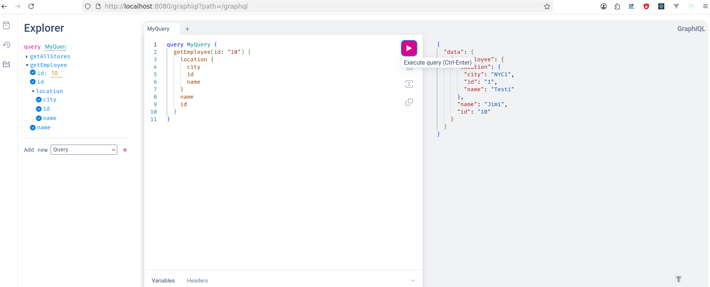

# task-management-hexagonal

Demo for hexagonal architecture

## Shell

```sh
nix-shell --run bash ./app.nix

mvn -N wrapper:wrapper -Dmaven=3.9.11

./mvnw -f ./task-management-backend/pom.xml -pl entrypoint spring-boot:run \
  -Dspring-boot.run.profiles=dev,repository-memory

./mvnw -f ./task-management-backend/pom.xml -pl build-tools clean install 
./mvnw -f ./task-management-backend/pom.xml verify
./mvnw -f ./task-management-backend/pom.xml site
./mvnw -f ./task-management-backend/pom.xml clean package
```

## Property: `spring.graphql.graphiql.enabled=true`

- path should be same as folder name where graphqls is kept
- `http://localhost:8080/graphiql?path=/graphql`
- 

## Observation

- Graphql doesn't support multipart file upload, to achieve this define a custom endpoint

## Todo

- Add custom starter with soft default config

## References

- <https://stackoverflow.com/questions/38133808/spring-multiple-profiles-active>
- <https://github.com/TejasRawat/task-management-service>
- <https://maven.apache.org/plugins/maven-pmd-plugin/examples/multi-module-config.html>
